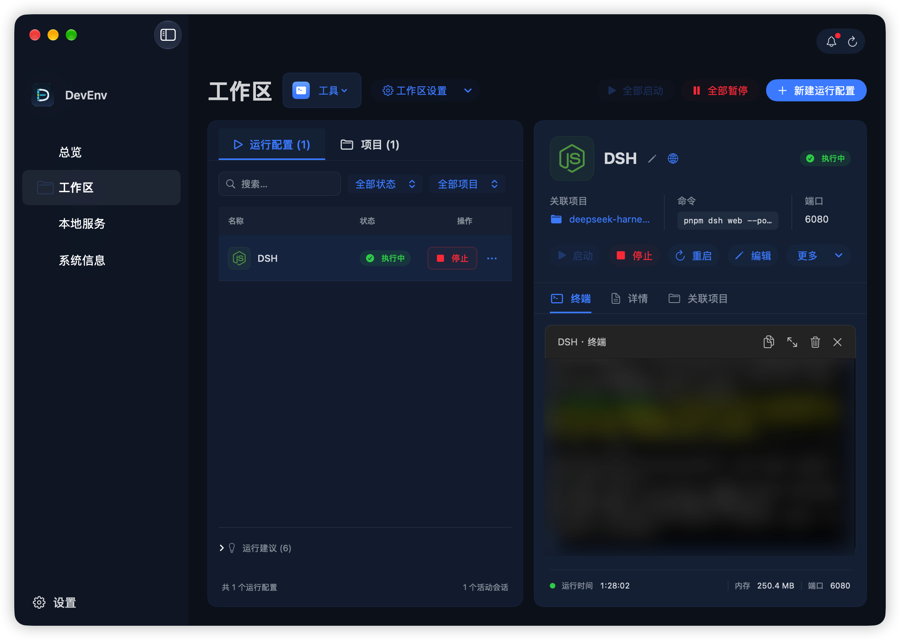
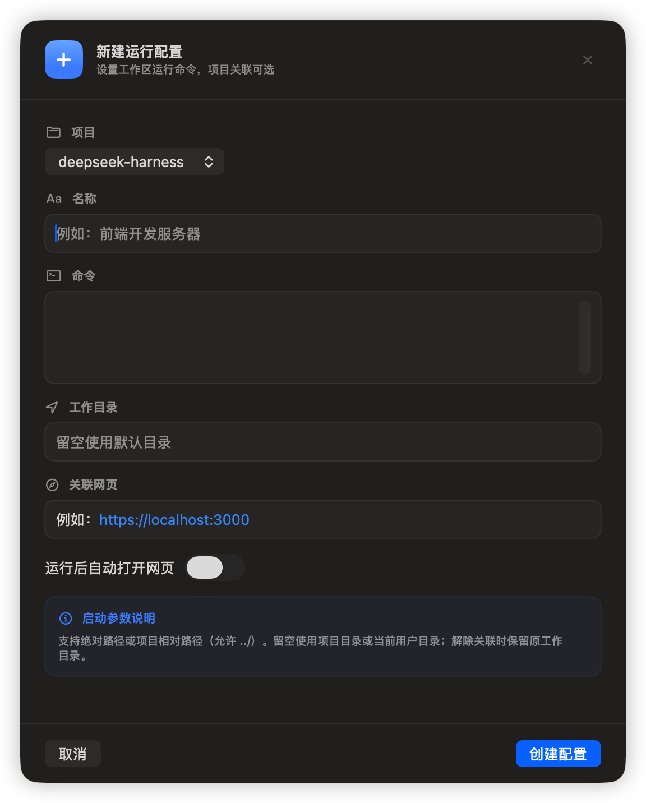
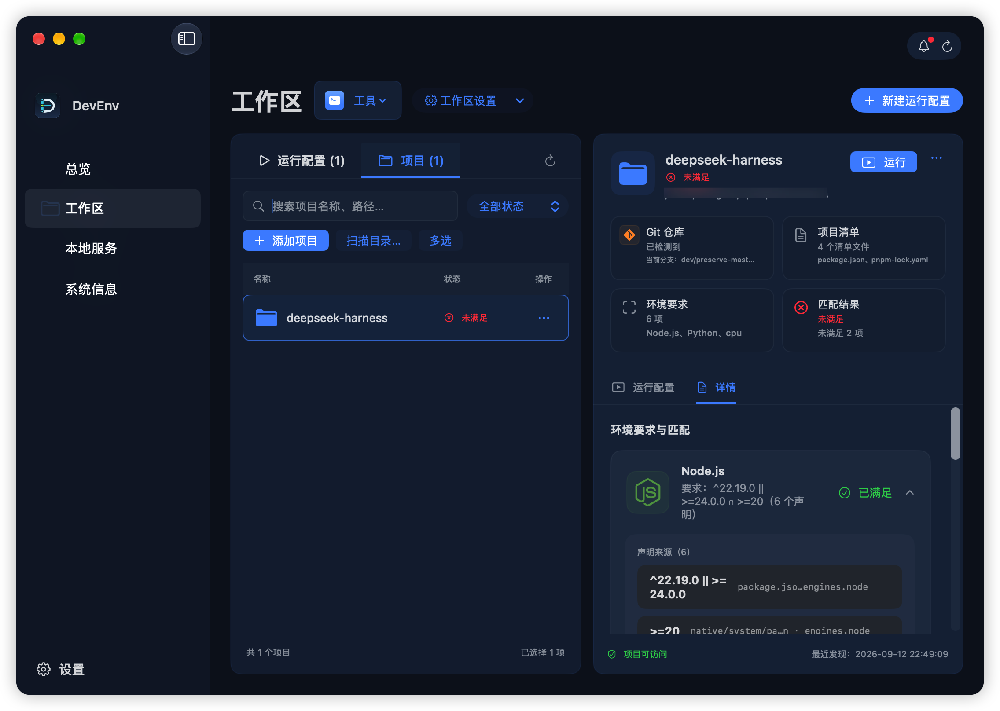

# DevEnv

> macOS 本地项目运行工作台。

开发一个项目时，前端、后端和其他服务往往需要分别启动，命令和工作目录散落在多个终端里。切换项目后，还需要重新确认本机工具是否符合项目要求。

DevEnv 是一个原生 macOS App，把常用启动命令保存为运行配置，让你在同一个工作台中启动、停止和重启，查看终端输出、监听端口、内存占用和 Git 分支。它也能读取项目声明，对照当前 Mac 上的工具与服务，帮助你理解运行条件。



*运行配置页把命令、执行状态和终端放在一起；底部显示运行时长、内存与可归属的监听端口。*

## DevEnv 能帮你做什么

| 日常需要 | 在 DevEnv 中怎么做 |
| --- | --- |
| 保存常用命令，减少重复输入 | 为前端、后端或其他任务创建具名运行配置，保存命令和工作目录 |
| 在多个项目之间切换 | 用工作区组织项目与运行配置，按项目、状态或名称筛选 |
| 集中管理开发进程 | 启动、停止、重启单项配置，或批量操作当前筛选结果 |
| 查看输出并继续操作 | 使用内置交互终端；命令结束后仍可输入下一条命令 |
| 打开本地开发页面 | 为配置设置关联网页，选择运行后延时自动打开 |
| 检查本机是否符合项目要求 | 添加项目，查看声明来源、本机证据和匹配结果 |
| 关闭窗口后继续工作 | 从菜单栏查看和操作会话；关闭主窗口会保留会话 |

DevEnv 使用你本来就在使用的 Shell 和开发工具。项目依赖仍需自行安装；扫描结果不会自动安装依赖或启动项目命令。

## 下载与安装

可下载的预览版本为 [`v0.2.3` Private Preview（Build 9）](https://github.com/zh826256645/DevEnv/releases/tag/v0.2.3)，面向受邀测试者，尚不属于稳定正式版。

发布版要求 **macOS 15.0 及以上、Apple Silicon（arm64）**，不包含 Intel 构建。

1. 从 [v0.2.3 Release](https://github.com/zh826256645/DevEnv/releases/tag/v0.2.3) 下载 `DevEnv-0.2.3-arm64.dmg` 和 `DevEnv-0.2.3-arm64.dmg.sha256`。
2. 将两个文件放在同一目录，在该目录打开终端并执行：

   ```bash
   shasum -a 256 -c DevEnv-0.2.3-arm64.dmg.sha256
   ```

   确认输出 `DevEnv-0.2.3-arm64.dmg: OK` 后再安装。
3. 完全退出旧版 DevEnv，打开 DMG，将 `DevEnv.app` 拖入 `Applications`，然后启动。

发布版使用 ad-hoc 签名，未使用 Developer ID 签名，也未经 Apple 公证。首次打开若被 Gatekeeper 阻止，请先尝试打开，再到“系统设置 → 隐私与安全性”确认打开；不要全局关闭 Gatekeeper 或递归移除隔离属性。

目前通过 Release 手动下载更新，不提供自动更新。升级前建议备份 App 数据，并结束需要保留的工作后完全退出旧版；运行会话和终端输出不会跨 App 进程恢复。版本变更与已知限制见 [v0.2.3 Release Notes](docs/releases/v0.2.3.md)。

## 第一次运行

从一条**已经能在终端中运行的命令**开始。无需先添加项目，也无需先完成环境扫描。

### 1. 打开工作区

在左侧选择“工作区”，使用默认工作区即可。需要分组时，点击“工作区设置 → 新建工作区”，例如为不同产品或常用工具分别建一个工作区。

工作区只是 DevEnv 内的组织方式，不对应磁盘目录。项目和运行配置各自属于一个工作区；每条配置的工作目录单独设置。

### 2. 新建运行配置

在“运行配置”页点击“新建运行配置”，填写名称、命令和工作目录。

<p align="center">
  
</p>

下面以一个已经安装依赖、且 `package.json` 定义了 `dev` script 的 Node.js 项目为例：

| 字段 | 示例与说明 |
| --- | --- |
| 项目 | 选择“不关联项目”即可；添加项目后也可关联同工作区内的项目 |
| 名称 | `前端开发服务器`，用于在列表和菜单栏辨认配置 |
| 命令 | `npm run dev`，替换为你在终端中使用的实际命令 |
| 工作目录 | `/Users/你的用户名/Projects/web-app`，替换为项目的实际绝对路径 |
| 关联网页 | 可选；填写服务实际提供的地址，例如 `http://localhost:5173` |
| 运行后自动打开网页 | 可选；打开后可设置延时，按服务启动所需时间调整 |

首次使用建议明确填写绝对工作目录。留空时，有效关联项目的配置使用项目目录，否则使用当前用户目录；项目相对路径需要关联项目。实际目录不可用时会启动失败。

关联网页只用于打开浏览器；自动打开按设置的延时触发，不检查服务是否已经就绪。

填好后点击“创建配置”。后端、文档站点或其他任务也可以按相同方式保存。

### 3. 启动并查看输出

选中配置，点击“启动”。DevEnv 会在指定工作目录中通过当前用户的默认登录 Shell 执行命令，在“终端”中显示输出，并展示运行状态。

- **停止**：相当于发送 Ctrl+C，中断当前命令并保留终端。
- **重启**：中断当前命令，等 Shell 就绪后回到配置工作目录，再执行配置命令。
- **关闭终端**：结束整个会话；命令结束后显示“终端就绪”时，也可关闭它。

终端可以继续手动输入命令，手动输入不会改写已保存的配置。当前支持默认登录 Shell 为 zsh、bash、fish 或 sh。

### 4. 管理日常运行

保存多条配置后，可通过筛选与搜索找到需要的任务，再批量启动或停止。运行页的批量操作针对**当前工作区的筛选结果**；菜单栏也提供跨工作区的会话操作。

切换页面、切换工作区或关闭主窗口都不会结束会话。要结束 DevEnv 持有的全部会话，请完全退出 App；重新打开后，配置仍保留，但不会自动执行。

## 检查项目与本机环境

当你需要了解“项目要求什么、这台 Mac 已经有什么”时，再添加项目。

1. 在“工作区 → 项目”点击“添加项目”，选择项目目录；也可使用“扫描目录…”批量发现项目。
2. 选中项目，在“详情”中查看环境要求、声明来源和匹配证据。
3. 根据未满足或无法判断的条目，自行检查或安装对应工具，再刷新检查结果。



*每项要求分别匹配：某项运行时已满足，并不表示整个项目的所有条件都已满足。*

DevEnv 会静态读取项目清单和版本文件，识别常见运行时、包管理器、系统与架构、数据库和 Compose 服务声明。支持范围包括 Node.js、Python、Go、Java、Rust、Ruby、Lua，以及 uv、Bun、npm、pnpm、Yarn 等工具。

匹配结果分为“已满足”“未满足”“无法判断”和“声明冲突”。这些结果说明本机证据是否匹配项目声明，不保证项目一定能运行；数据库安装或端口监听也不等于连接、鉴权和服务健康检查。

项目声明中可识别的 Node.js scripts、uv 项目 scripts、Rust bin target 和 Compose 配置会提供运行建议。你可以选择采纳为配置，扫描不会自动执行这些建议。

左侧“系统信息”和“本地服务”提供本机工具、运行时、Git、Shell、数据库安装与 TCP 监听等信息。对当前用户可管理的 Homebrew 服务，可以在查看具体命令并确认后启动、停止或重启。

移除 DevEnv 中的项目记录不会删除、移动或修改原项目目录，也不会删除关联运行配置。项目关联失效后，需要解除或重新关联才能再次启动该配置。

## 使用边界

- DevEnv 当前不启用 App Sandbox；你启动的命令以当前用户权限运行。
- 项目分析静态读取声明，不执行项目代码。环境扫描为获取工具搜索路径会加载用户登录 Shell 初始化文件；这些文件可能产生自身的副作用，详见 [PATH 初始化说明](docs/adr/0013-initialize-machine-tool-search-path-from-login-shell.md)。
- 停止操作相当于 Ctrl+C，不强制杀死无响应的命令；必要时可显式关闭终端。进程操作受归属核验与系统权限约束。
- 端口只在能够可靠归属于会话时显示；没有端口信息不代表没有服务，终端就绪也不代表后台进程已经结束。
- 工作区、项目记录、运行配置和最近一次成功的环境扫描结果保存在本机；会话状态、终端输出和退出码只存在于当前 App 进程。

## 从源码运行

需要 macOS 15 或更高版本、支持 Swift 6 的 Xcode，以及首次解析 SwiftTerm 依赖时的 GitHub 网络访问。

```bash
git clone https://github.com/zh826256645/DevEnv.git
cd DevEnv
git switch develop
open DevEnv.xcodeproj
```

在 Xcode 中等待 Swift Package Manager 解析依赖，选择 `DevEnv` scheme 和 `My Mac`，然后运行。源码构建使用本地开发签名。

项目使用 Swift 6、SwiftUI、AppKit、Swift Concurrency、Combine 和 SwiftTerm 1.11.2，通过 macOS Process、PTY 与 Darwin process API 管理会话，使用本机 Application Support 保存数据。

领域术语与设计决策见 [CONTEXT.md](CONTEXT.md) 和 [ADR 目录](docs/adr/)，其中包括 [工作区与独立运行配置](docs/adr/0014-organize-independent-runs-in-workspaces.md)、[持续交互终端](docs/adr/0015-support-persistent-interactive-run-terminals.md) 和 [为何不启用 App Sandbox](docs/adr/0001-run-without-app-sandbox.md)。

## 参与项目

Bug、功能需求和设计讨论请提交到 [GitHub Issues](https://github.com/zh826256645/DevEnv/issues)，代码变更可通过 [Pull Requests](https://github.com/zh826256645/DevEnv/pulls) 提交。版本历史和后续计划以 Git 提交与 GitHub Issues 为准，构建与发布流程见 [发版流程](docs/releasing.md)。

README 截图统一保存在 `docs/images/readme/`。更新截图时沿用 `run-workspace.png`、`create-run-configuration.png` 和 `project-requirements.png`，即可保持引用有效；截图中请隐去私人路径和敏感信息。

## License

本项目采用 [MIT License](LICENSE)，Copyright (c) 2026 西瓜树。第三方依赖和 Logo 仍遵循各自的许可证及品牌使用条款。
